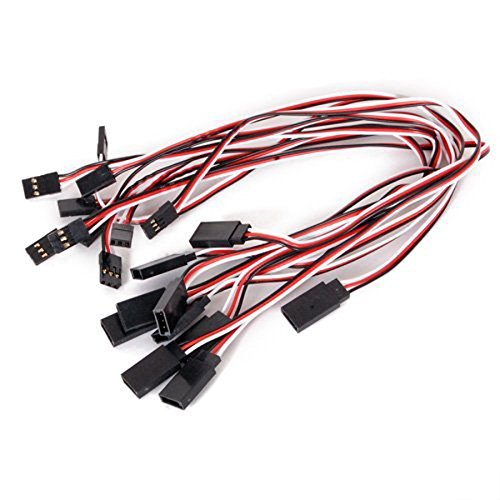
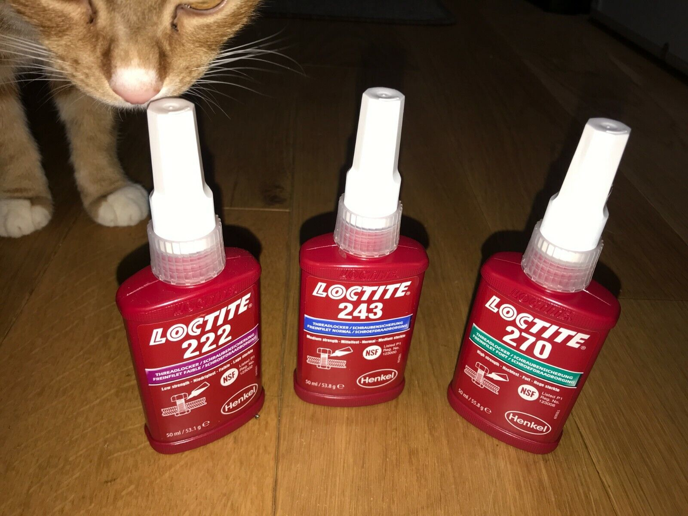

> **Disclaimer:** This tutorial is part of a comprehensive series that I've created to guide you through the process of building a spider robot. Each tutorial in the series is designed to cover a specific aspect of the project, providing detailed instructions and insights to help you understand and replicate the steps.
> 
> You can find the entire series [here](../README.md). I encourage you to explore all the tutorials in the series to gain a complete understanding of the project. Whether you're a beginner or an expert, I hope you find these resources helpful and informative. Happy building!

#Selecting Tools, Hardware Components & Designing 3D Printed Parts for you Spider robot

Here I will keep track of components I have used and add my consideerations so maybe you will avoid mistakes that i made.
I'm not affiliated with any of the companies making those products and links below are not affilaite links.  After going through my list, You have to make your own reasearch and make up your mind. 

General idea
General idea came up when I accidently seeing the youtube movie by Make Your Own Pet project. i thought building your own heaxapod,  could be great time killer during long COVID quarantines and opportunity to learn robotics.

Its good idea to join Make Your Own pet and ask ther eif you have any doubts great community there will help you clarify them.
If you want to learn just visit their web page:
https://www.makeyourpet.com/
Github: 
or Youtube:

# Hardware
Coreless servo high speed, high torque 35kg+ servo motor.
It would be great to have brushless motor with position feedback one but unfortuantely those are really expensive. For basic standard brushed servo is enough.

- Micro Switches 
Used as leg touch sensors.
https://www.amazon.co.uk/gp/product/B07YDFH7H3

Servo Controller 

https://shop.pimoroni.com/products/servo-2040?variant=39800591679571
Servo controller will use firmware provided 
I wrote a Python class that communicates with it.

Spider brain
- I used Raspberry Pi 4 Model B. To be honest any Raspberry clone will do as long as it supoort linux distribution with Python enviroment. More RAM the better.
Raspberry handles all the robot logic, like gaits, sensors, communication with Gamepad controller and  

- Servo Extension Cables 
Buy long (30cm) and short (10-15 cm) extension cables to not be forced to cut or ziptie too much cable as cable management will be one of the most difficult battles you will face.

https://www.amazon.co.uk/gp/product/B06W9MRNWL

- Łozyska . For the 3d parts i created perfect bearings are . If you choose diffreernt 3d printed model just make sure your bearings fit the parts. Justb like in Make Your Own pet your model might not need ones. 
You need 3 bearing per leg.

- 2S Lipo Battery 
I have used Zeee 2S Lipo Battery 6200mAh 7.4V 60C battery. It fits perfectly robots battery compartment. I had to solder XT30 plus thou as i decided this type to be a standard power connector for my robot.
https://www.amazon.co.uk/gp/product/B07YD6282M

- 5V Step Down Buck Module
You need 5V to power up your but your battery provides 7.4V. You need o nverter that will take variable voltage provided by the battery and provide you with stable 5volts. the best would 3Amps one. I used 2A and so far it works. But you might want to search for the one that provides more power especially if you plan to connect any additional accessories to the raspberry (like cammera). 
https://www.aliexpress.com/item/4000084079149.html

- USB-A to USB-C short cable to connect your Spider's brain with Servo controller
https://www.aliexpress.com/item/1005005240135902.html

- Long USB-A to USB-C cable -  this will be used for developemnt . I found that it's much easier to actually develope code on my laptop that do it on raspberry. You need a long cable do it can interface between your laptop and the robot. 2 or more meters will be fine.

- Scalpel Knife mostly to clean 3d printed parts.
https://www.aliexpress.com/item/1005004898484210.html

- Metal Servos Mount Aluminum Metal 25T Servo Arm Round type
https://www.aliexpress.com/item/32966238529.html

-Toggle switch , to turn robot on and off. i have used 12V ILLUMINATED LED TOGGLE SWITCH AIRCRAFT MISSILE FLIP

- Braided Cable Sleeve PET Self Closing
For cable management and To wrap easily loose cables. It's easy to use and looks great.
https://www.aliexpress.com/item/4000279970497.html

- Zip ties

- Gamepad controller
You need a way to control your robot's movements. For this purpose  you can use any HID compatible controller. You can ask seller if the device is HID compatible. I'm using Radiomaster XT16S that allows me to connect via USB or bluetooth (with additional module).

Śrubki. For this project you need multiple . There are sets consisiting of available onine. Just dont make my  istake and dont buy with different bit size. It's good idea to buy hexagonal bit screws for this project because traditional flat or cross head might not work that well if screw gets stuck.Dont make my mistake and dont buy 2 different set with different size of hex socket size. 2 set's like that should have you covered.
https://www.amazon.co.uk/gp/product/B093ZKJHX6

Tools
You will need few tools.
-Soldering set. 
Soldering iron
I went for USB powered Soldering iron. It's light and you can use it in the field if needed. I use it for all

-One of the most improtant tools is Mini Cordless Precision Electric Screwdriver. i went for the one made by CreationSpace. You will screw and unscrew hunderds of screws. doing this by hand can drive you mad.

- Digital Servo/ESC Consistency Tester 
You will need to 

3D printer i woned fuw 3d printers . Just go through reviews , i beleive for project like this additive as its cheap , easy to and relatively safe and you don't need that level of detail offered by . I'm sure you can go for printer as well.
I used the one that has very good value to the price relation ANYCUBIC Kobra Go 3D

- Loctite 222 or 243 Thread Locker, 222 is enough 

https://www.ebay.co.uk/itm/234875064736

3D parts
i was looking for few options and i found through one of the users called "" active on Make Your Own Pet discord server developed modular 3d parts for his robot. I liked how clean and easy to modify and as he provided permisisve licence and source files for all parts i knew this could be a great way to go.
After first few prints and puting the first leg together i noticed  few drawbacks of his solution.
First of he did not use bearings so i decided to .
His robot did not have any body or enclosure protecting so first i've develoepd lttle box and decided  to create 3 parts.
Design lets you to build quadruped or hexapod robot. To cut on costs. But bear in mind quadruped robot will be slower (can move one leg at the time) and it's much harder to actiually programme stable gait.

So as you can see that was very iterative process.
I've never had any extensive CAD experience and even thou i was able to create quite complicated designs. I advise you to download Fusion 360 and try it yourself. 
For filament i decided to choose black PLA filament as its strong, non toxic and cheap.
All 3d paerts are availble in this repository.
[link here]