# Spider Robot Building Guide: Tools, Hardware Components, and 3D Printed Parts

> **Disclaimer:** This guide is a part of an extensive series focused on constructing a spider robot from scratch. Each installment targets a specific topic to provide you with a comprehensive understanding of the entire process. Whether you are a beginner or an expert in robotics, these resources aim to be both insightful and instructive. Happy building! To access the full series, click [here](../README.md).

## Introduction and Inspiration

The inception of this project can be traced back to a YouTube video from the 'Make Your Own Pet' series. This particular venture piqued my interest as an engaging and educational pastime during the long days of COVID-19 quarantines. To put it in short, the idea is to use a smartphone as the main controller for your hobby project. If you have questions or would like to become part of a community interested in similar projects, I recommend joining their [discord](https://www.makeyourpet.com/) or exploring their [GitHub](https://github.com/makeyourpet/hexapod) and [YouTube](https://www.youtube.com/makeyourpet) channels.

## Affiliation

**I am not affiliated** with any of the companies that manufacture the components used in this project. The links provided are not affiliate links and are included solely for informational purposes. The information is based on my personal experience and is intended for educational use. I strongly recommend conducting your own research and consulting various sources before making any purchasing decisions or implementing these components into your projects.

---
## 3D Printing and Design

I leveraged Fusion 360 to design custom components for my spider robot, even without extensive CAD experience. I opted for black PLA filament, which offers a good blend of strength, safety, and affordability. The 3D files for all components can be found in this [repository](link here).

I decided **not to use** the official MakeYourPet 3D parts. Instead, I discovered that one of the Discord server users, named 'amelendez8', was working on his own design [here](https://github.com/almelnz2005/hexapod).
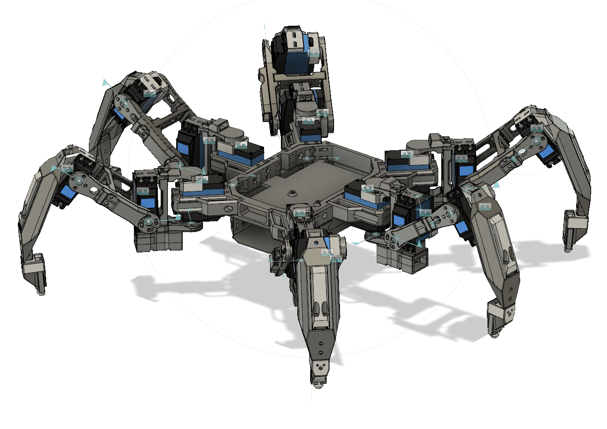

 Since this design was very modular, he shared the source files, the license was permissive, and I liked the techy look and feel, I decided to adjust the design to meet my needs.

The design process was iterative and took considerable time. Initially, I designed a separate enclosure for the Raspberry Pi and servo controller. 
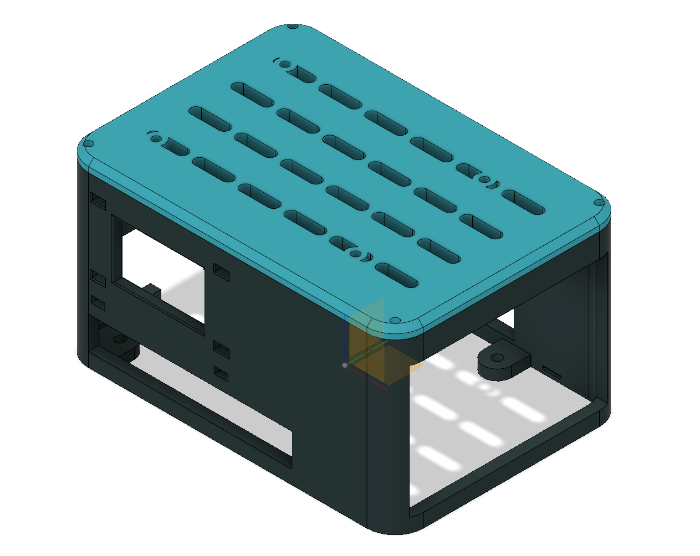
However, this initial design was visually and functionally disjointed from the overall aesthetic and architecture of the robot.
Realizing the limitations, I opted for a more integrated approach by designing a larger spider robot carapace. 

This new design was superior for several reasons. Firstly, it provided a unified, streamlined look that harmonized with the other modular components. Secondly, the carapace could accommodate and neatly conceal all the electronics, eliminating the clutter of exposed wires and creating a cleaner, more professional appearance. 
Lastly, this unified housing simplified the assembly process, making it easier to access components for future upgrades or maintenance.

I initially made the mistake of placing the Raspberry Pi at the bottom, with the servo controller suspended above it. This configuration made it challenging to open the carapace without detaching all the servo cables. To rectify this, I later repositioned the Raspberry Pi on the roof of the body while keeping the servo controller attached to the floor.

The carapace also underwent several minor modifications to optimize the available internal space.

Next, I decided to replace the bolt-like joint design with one that utilizes bearings. This required reworking every joint in the legs, which basically consisted of two parts.

Since I started with a quadruped robot, balancing it during walking was a significant challenge. After some tests, I discovered that the robot could benefit from a larger range of movement. To achieve this, I needed to extend the length of the leg's tibia.

Finally, I made some holes in the body to accommodate the on/off switch, some LCD screens, and the cooling fan.

The repository with the most up-to-date design can be found here: [insert link]

## Hardware Components

### Servo Motors: Coreless vs. Brushless, Range and Resolution Considerations

When building a spider robot, the type of servo motor you choose is paramount. Coreless high-speed, high-torque servo motors with a rating of 35kg+ are recommended for this project. However, brushless motors with positional feedback provide greater accuracy and longevity, though they come with a hefty price tag. 

When selecting a servo motor for your project, it's crucial to consider the range of motion you'll need. Servo motors commonly come in ranges like 180° or 270°. A servo with a wider range (e.g., 270°) will offer more flexibility in movement but may have a lower resolution, meaning less precise control over small movements. On the other hand, a 180° servo might offer higher resolution, allowing for more precise positioning but with a limited range. Choose a servo that best fits the specific requirements of your project for optimal performance.
[Servo Motors i have used on Aliexpress](Your-Link-Link-Here)

### Servo Mounting: Metal 25T Servo Arm Round Type

For robust and reliable servo mounting, I recommend using Metal Servos Mount Aluminum Metal 25T Servo Arm Round Type. These mounts are made of high-quality aluminum, providing excellent durability and stability. The 25T round type design ensures a secure fit and optimal torque transfer, making it an ideal choice for projects that require precise and consistent servo movements.
[Metal Servos Mount Aluminum Metal 25T Servo Arm Round Type on Aliexpress](https://www.aliexpress.com/item/32966238529.html)
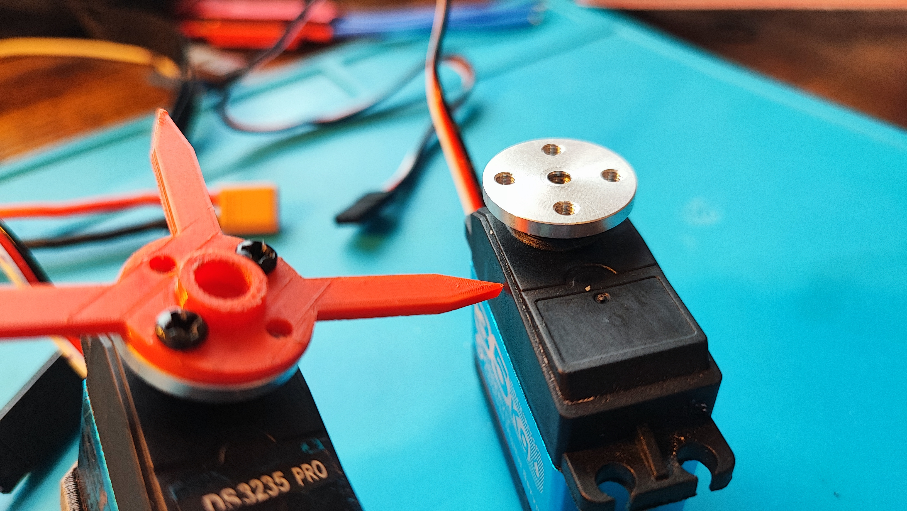

### Micro Switches for Leg Sensors

Touch-sensitive micro switches act as leg sensors, providing crucial input for the robot's movement algorithms. These can be easily procured from [Amazon](https://www.amazon.co.uk/gp/product/B07YDFH7H3).

### Servo Controller 

The Servo 2040 - 18 Channel Servo Controller is the backbone for servo operations. Its firmware aligns with the 'Make Your Own Pet' project, and I've crafted a Python class for easy communication with the spider's 'brain.'
[Servo 2040 - 18 Channel Servo Controller](https://shop.pimoroni.com/products/servo-2040?variant=39800591679571)

#### Why This Controller is a Good Choice
- **Versatile**: Supports up to 18 servos, ideal for complex robotics.
- **Power Monitoring**: Built-in current tracking for optimized power use.
- **Visual Feedback**: Six RGB LEDs for immediate status updates.
- **Sensor Support**: Headers for six analog sensors for added functionalities.
- **RP2040 Core**: Benefits from the flexibility of RP2040's Programmable IOs (PIOs).

### The Spider Brain: Raspberry Pi 4 Model B

A Raspberry Pi 4 Model B or a similar board that supports a Linux-based OS and Python environment is ideal for executing the robot's complex logic. This includes gait algorithms, sensor inputs, and communication with the Gamepad controller.

### Servo Extension Cables 

Investing in both long (30cm) and short (10-15cm) extension cables saves you from having to engage in tedious cable management. 

[Servo Extension Cables on Amazon](https://www.amazon.co.uk/gp/product/B06W9MRNWL).

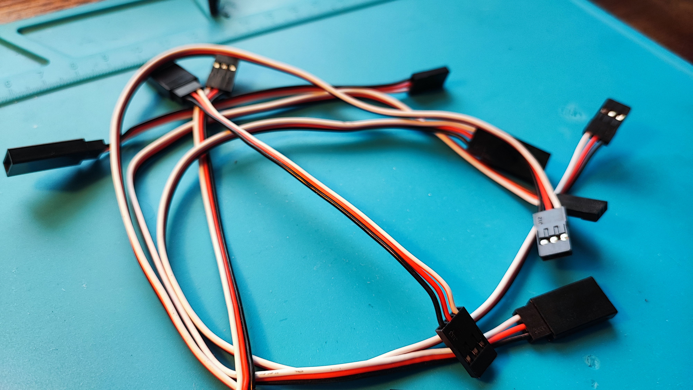

### Cable Management: Braided Cable Sleeve PET Self Closing

Effective cable management is crucial for both aesthetics and functionality. I recommend using a Braided Cable Sleeve PET Self Closing for wrapping loose cables. This sleeve is not only easy to use but also provides a clean and organized look to your project. Its self-closing feature ensures that your cables stay securely bundled, reducing the risk of tangling or snagging. 

[Braided Cable Sleeve PET Self Closing on Aliexpress](https://www.aliexpress.com/item/4000279970497.html)

### Bearings

For smooth mechanical performance, bearings are an essential part of the 3D printed components. If you opt for a different 3D model, ensure your bearings are compatible. For my design use model 625zz. There are 3D printed robot designs available that does not need those - just check 'Make Your Own Pet' project.

### Power Control: 12V Illuminated LED Toggle Switch Aircraft Missile Flip

To easily control the power supply to the robot, I've used a 12V Illuminated LED Toggle Switch Aircraft Missile Flip. This toggle switch not only serves the functional purpose of turning the robot on and off but also adds a bit of aesthetic appeal with its illuminated LED and aircraft missile flip design.
[12V Illuminated LED Toggle Switch Aircraft Missile Flip](Your-Link-Here)

### Power Source: 2S Lipo Battery

The Zeee 2S Lipo Battery 6200mAh 7.4V 60C is an excellent fit for this project, easily fitting into the robot's battery compartment. I decided to solder an XT30 plug for compatibility with the rest of my build. 

[The Zeee 2S Lipo Battery 6200mAh 7.4V 60C on amazon UK](https://www.amazon.co.uk/gp/product/B07YD6282M)

### Wires: Selecting the Right Gauge and Insulation

Choosing the correct wires is essential for both the functionality and safety of your project. For signal wires, I highly recommend using 22-24 AWG, as these gauges are generally suitable for low-current signal transmission. For power wires, 14-16 AWG is the go-to choice to ensure they can handle the current without overheating. I strongly advise opting for silicon-covered wires; they offer superior heat resistance and flexibility compared to other types of insulation. Silicon-covered wires are also more manageable when working in tight spaces or routing through complex assemblies.
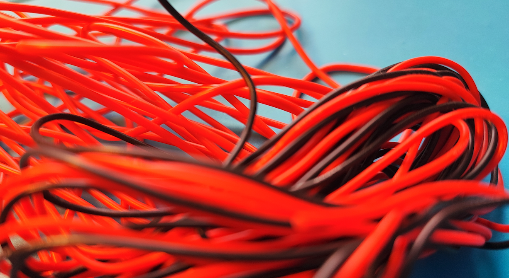

### 5V Step Down Buck Module

To convert the 7.4V from your battery to a stable 5V for the Raspberry Pi, a step-down buck module is essential. Opt for one that can deliver at least 3A of current. 
[2A 5V Step Down Buck Module I have used on Aliexpress (you might need 3A)](https://www.aliexpress.com/item/4000084079149.html)

### USB Cables

Two types of USB cables are needed:
- A short USB-A to USB-C for connecting the Raspberry Pi to the Servo Controller. 
[A short USB-A to USB-C on Aliepxress](https://www.aliexpress.com/item/1005005240135902.html)
- A long USB-A to USB-C for development purposes, allowing seamless interfacing between your laptop and the robot. 

---

## Additional Supplies and Tools

### Gamepad Controller 

A Human Interface Device (HID)-compatible gamepad controller is necessary for direct control of the spider robot's movement. The Radiomaster XT16S is a reliable choice, offering both USB and Bluetooth connectivity (with additional module). You can choose any HID compatible controller.
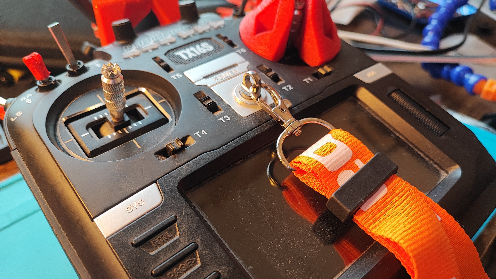

### Screws: Choosing the Right Type and Size

For this project, it's crucial to select the right screws to ensure durability and ease of assembly. I highly recommend using hexagonal bit screws over traditional flat or cross-head screws. They offer superior torque control and are generally easier to work with.  
[You can find sets of these screws available on Amazon UK](https://www.amazon.co.uk/gp/product/B093ZKJHX6).

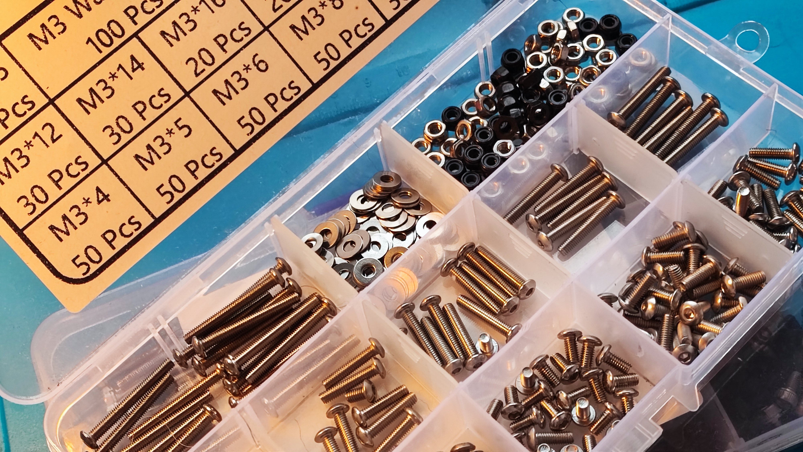

**Note**: Be cautious when purchasing screw sets; make sure to buy sets with consistent hex socket sizes. I made the mistake of buying two different sets with varying hex socket sizes, which complicated the assembly process. Two sets (around 500 pieces each) of mixed sizes should have you covered for this project.

### Fasteners/Zip Ties
You will need a lot of zip ties to keep all your cables under control. Zip ties are not only an inexpensive but also an effective solution for managing the maze of wires that power the servos, sensors, and the central processing unit. Opt for a variety pack that includes ties of multiple lengths and widths, as you'll find various applications for each size. High-quality zip ties are recommended for long-lasting durability, especially since the cables will often be in motion, causing wear and tear on the ties themselves.

## Other Tools
- **Scalpel Knife/Box cutter:** After 3D printing, it's common to have some imperfections or excess material on your parts. A Scalpel Knife is an excellent tool for cleaning up these minor flaws. It allows for precise cuts and can easily remove brims, supports, or any other unwanted material, leaving you with a cleaner, more professional-looking component.
[Scalpel Knife on Aliexpress](https://www.aliexpress.com/item/1005004898484210.html)

- **Soldering Set:** A USB-powered soldering iron is portable and can be used in field adjustments. 
Additionally, a soldering third arm can be incredibly helpful for holding components in place while you work, and a soldering cleaner is essential for maintaining the tip of your soldering iron, thereby ensuring more precise and effective soldering.
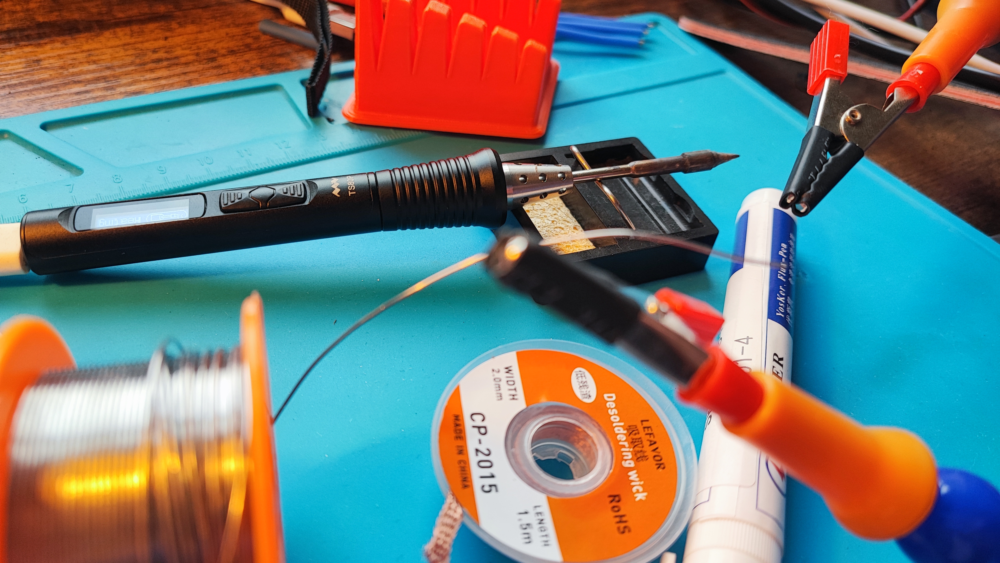
[USB-powered soldering iron on Aliexpress]()
- **Mini Cordless Precision Electric Screwdriver:** Given the hundreds of screws you'll be working with, this tool is indispensable.
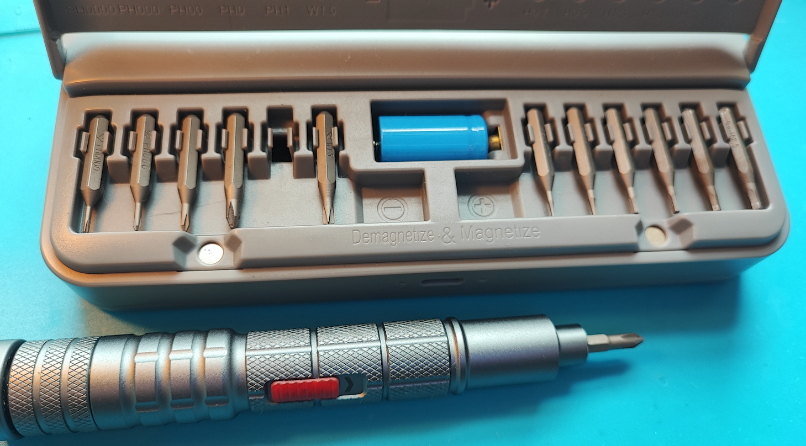
- **Digital Servo/ESC Consistency Tester:** This is crucial for calibrating and testing your servo motors.
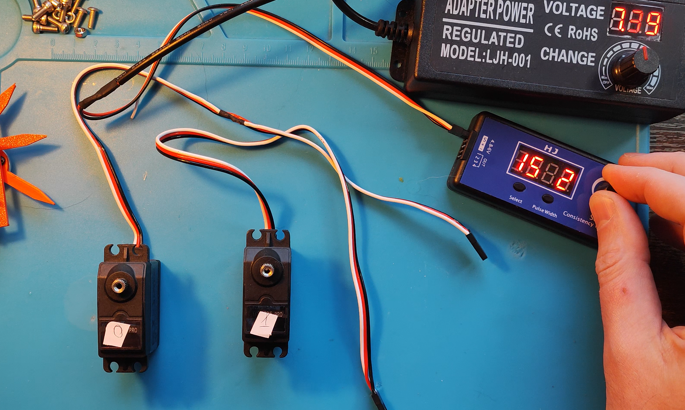
- **Multimeter:** It's highly advisable to use a multimeter during the setup and testing phases. A multimeter will allow you to accurately measure voltage, current, and resistance, ensuring that all components, including the Servo Controller or Raspberry, are operating within their specified ranges. This is crucial for both the safety and the successful execution of your project.
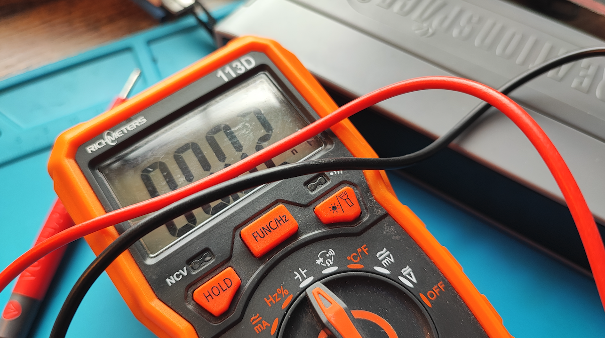
---

---

By following this guide, you'll have a comprehensive understanding of the hardware, electronics, and additional supplies needed to build your own spider robot. Feel free to dive into each section for a more in-depth understanding, and happy building!
